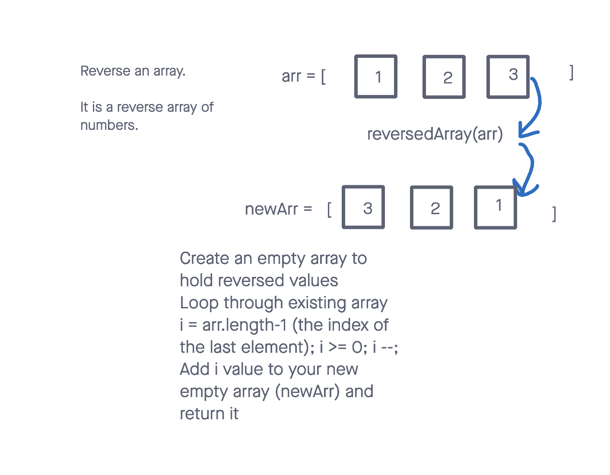

# Reverse Array

It is a function called reverseArray which takes an array of numbers as an argument and returns an array of numbers in a reversed order.

## Whiteboard Process

## Approach & Efficiency

Without using any methods, I came up with the idea of creating a new array and simply adding values to it. Afterward, I concluded that running a loop would be the most logical choice. I realized that we should start from the last element, making it the first in our new array. Finally, it returns the new array.

## Solution

let newArr = [];

for (let i = arr.length - 1; i >= 0; i--) {
    newArr.push(arr[i]);
}

return newArr;
