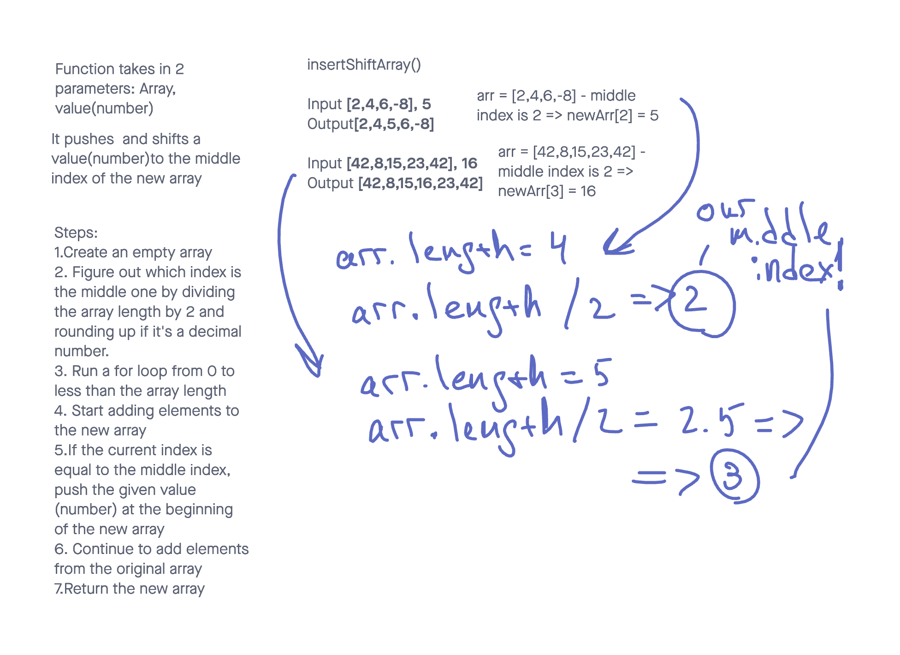

# Insert Shift Array

It is a function called insertShiftArray which takes an array of numbers and a value (number) as an argument and returns an array where the value is at the middle index of the array.

## Whiteboard Process

## Approach & Efficiency

1. Create an empty array to store the new elements.
2. Determine the middle index of the original array by dividing its length by 2 and rounding up if it results in a decimal number.
3. Run a for loop from 0 to less than the length of the original array.
4. Begin adding elements to the new array.
5. If the current index matches the middle index, push the given value to the beginning of the new array.
6. Continue adding elements from the original array to the new array.
7. Return the new array as the result.

## Solution

function insertShiftArray(arr, value) {
  const newArray = [];
  const middleIndex = Math.round(arr.length / 2);
  for (let i = 0; i < arr.length; i++) {
    if (i === middleIndex) {
        newArray.push(value);
      }
      newArray.push(arr[i]);
    }
  return newArray;
}
