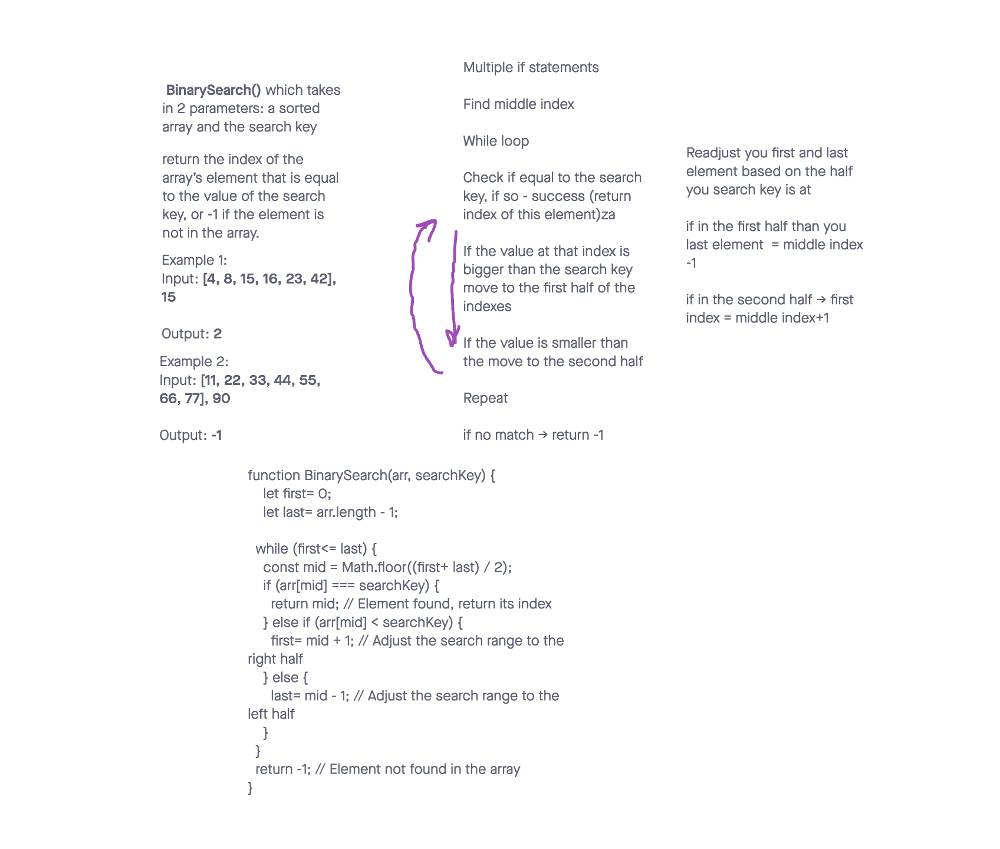

# Binary Search

It is a function called binarySearch which takes an array of numbers and a search query (number) as parameters and returns the index of the array’s element that is equal to the value of the search key, or -1 if the element is not in the array.

## Whiteboard Process

## Approach & Efficiency

1. Define first and last indexes in the array
2. Run a loop while first index is smaller or equal to the last one
3. Find middle index
4. Check if middle is equal to the search key. If it is, you can return the index.
5. If the value at that index is bigger than the search key, move to the first half of the indexes, change your last index to middle - 1
6. If the value is smaller than the search key, move to the second half, change your first index to middle + 1
7. Repeat
8. If no match, return -1

## Solution

function BinarySearch(arr, searchKey) {
  let first= 0;
  let last= arr.length - 1;
  while (first<= last) {
    const mid = Math.floor((first+ last) / 2);
    if (arr[mid] === searchKey) {
      return mid; // Element found, return its index
    } else if (arr[mid] < searchKey) {
      first= mid + 1; // Adjust the search range to the right half
    } else {
      last= mid - 1; // Adjust the search range to the left half
    }
  }
  return -1; // Element not found in the array
}
