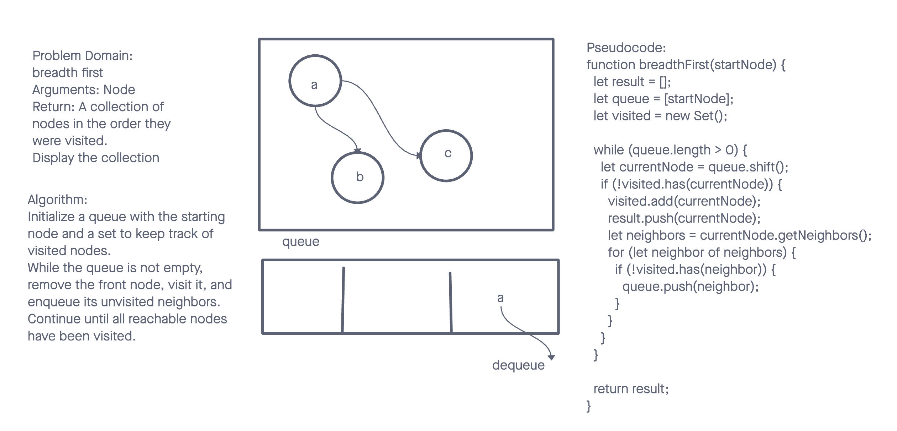

# Data Structures and Algorithms

## Graph (Breadth-First Traversal)

A Graph is a non-linear data structure consisting of nodes (also called vertices) and edges that connect these nodes. Graphs can be used to represent various real-world problems, including social networks, computer networks, and many more.

## Whiteboard Process

### Approach & Efficiency

The breadth-first traversal method uses a queue to keep track of the nodes to be visited and a set to remember the visited nodes. It ensures that each node is visited exactly once, even in graphs with cycles.

### Big O

- breadthFirstTraversal(startVertex)
  Time Complexity: O(V + E), where V is the number of vertices and E is the number of edges, since every vertex and edge will be explored in the worst case.
  Space Complexity: O(V), as we need to store the visited nodes.

## Solution

- [Code Link](./index.js)
- [GitHub Actions](https://github.com/KatKho/data-structures-and-algorithms/actions)
