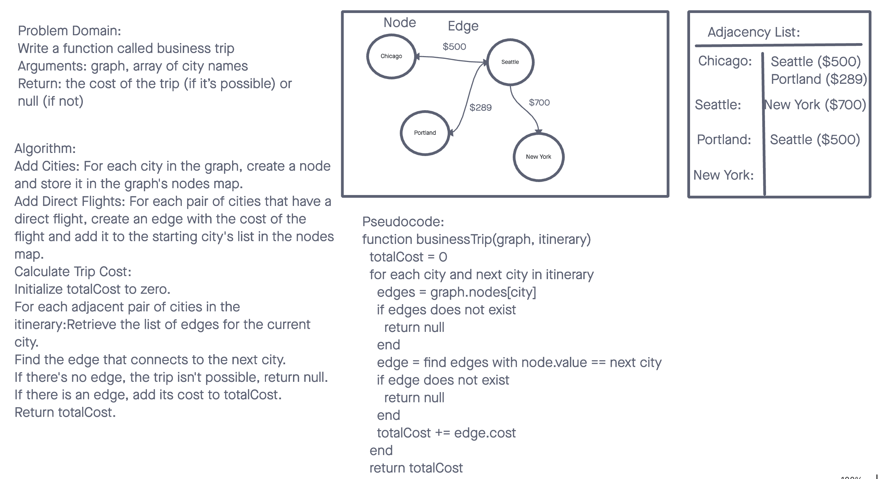

# Data Structures and Algorithms

## Business Trip

A Graph is a non-linear data structure consisting of nodes (also called vertices) and edges that connect these nodes. In the context of a business trip, we can use a graph to model a network of cities with direct flights (edges) between them. The Business Trip challenge involves determining whether a trip between a series of cities is possible using only direct flights and calculating the total cost of the trip if it is possible.

## Whiteboard Process

## Approach & Efficiency

For the business trip challenge, we utilize a custom method to iterate through the provided itinerary and check the graph for direct connections between each pair of cities.

## Big O

- businessTrip(graph, itinerary)
  Time Complexity: O(n) where n is the number of legs (or connections) in the itinerary, as we need to check each leg for a direct flight.
  Space Complexity: O(1), as we do not allocate any additional data structures that grow with the input size.

## Solution

- [Code Link](./index.js)
- [GitHub Actions](https://github.com/KatKho/data-structures-and-algorithms/actions)
