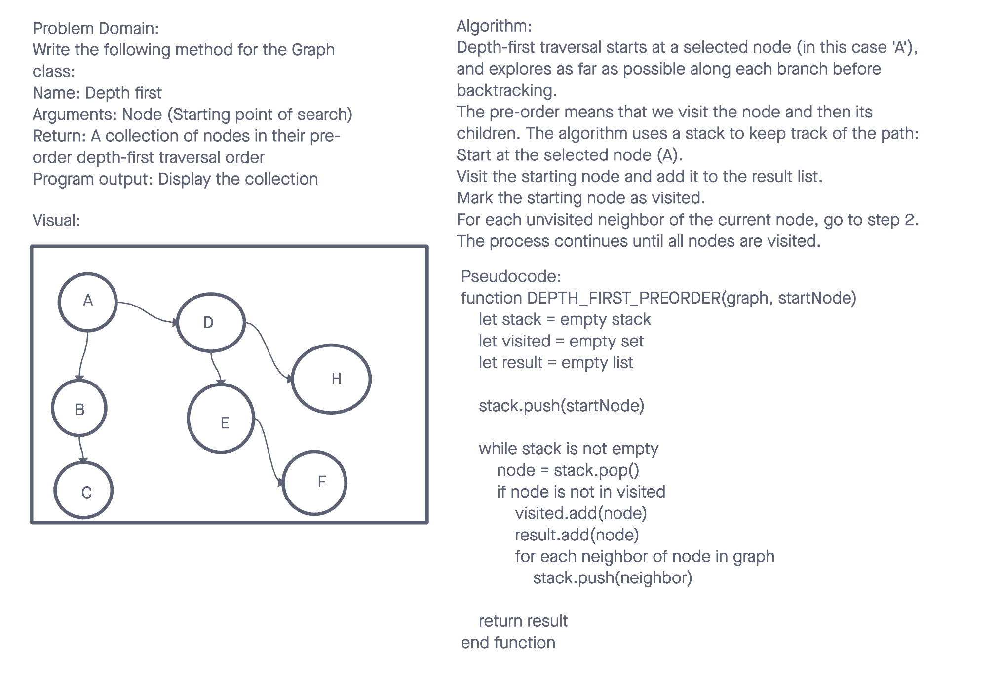

# Data Structures and Algorithms

## Depth-First Pre-Order Traversal on a Graph

A graph is a non-linear data structure consisting of nodes (also called vertices) and edges that connect these nodes. The depth-first pre-order traversal is a technique used to explore the graph in a way where we start at a selected node and explore as far as possible along each branch before backtracking.

## Whiteboard Process

## Approach & Efficiency

For the depth-first pre-order traversal challenge, we implemented a method within our Graph class that traverses the graph from a starting node. The method uses a stack to keep track of the nodes as it traverses, ensuring each node is visited in the correct pre-order sequence.

## Big O

- `depthFirstPreOrder(start)`
  - Time Complexity: O(V + E) where V is the number of vertices and E is the number of edges in the graph. This is because in the worst case, we visit all vertices and check all edges.
  - Space Complexity: O(V) due to the storage of the stack and the visited set, which in the worst case might contain all vertices of the graph.

## Solution

- [Code Link](./index.js)
- [GitHub Actions](https://github.com/KatKho/data-structures-and-algorithms/actions)
