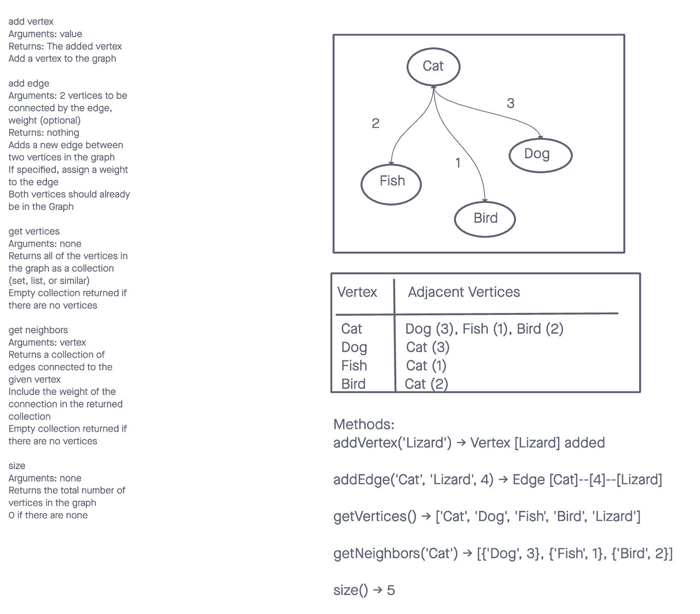

# Data Structures and Algorithms

## Graph

A Graph is a non-linear data structure consisting of nodes (also called vertices) and edges that connect these nodes. Graphs can be used to represent various real-world problems, including social networks, computer networks, and many more.

## Whiteboard Process

## Methods

- addVertex(value): Adds a new vertex to the graph.
- addEdge(vertex1, vertex2, weight): Adds a new edge between two vertices in the graph. If a weight is specified, it assigns that weight to the edge.
- getVertices(): Returns all the vertices in the graph as a collection.
- getNeighbors(vertex): Returns a collection of edges connected to the given vertex, including the weights of the connections.
- size(): Returns the total number of vertices in the graph.

## Big O

- addVertex(value)
  Time Complexity: O(1)
  Space Complexity: O(1)

- addEdge(vertex1, vertex2, weight)
  Time Complexity: O(1)
  Space Complexity: O(1)

- getVertices()
  Time Complexity: O(n), where n is the total number of vertices
  Space Complexity: O(n)

- getNeighbors(vertex)
  Time Complexity: O(n), where n is the number of edges connected to the vertex
  Space Complexity: O(n)

- size()
  Time Complexity: O(1)
  Space Complexity: O(1)

## Solution

- [Code Link](./index.js)
- [GitHub Actions](https://github.com/KatKho/data-structures-and-algorithms/actions)
