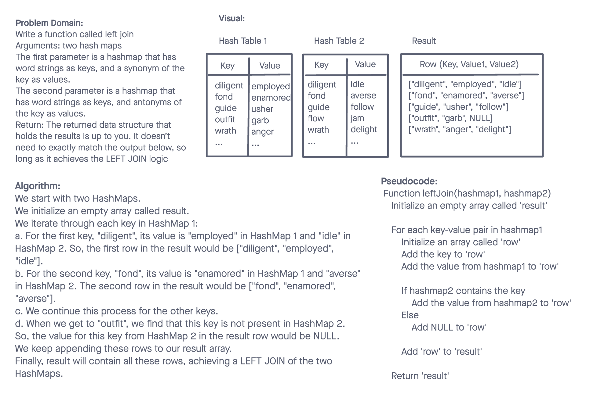

# Data Structures and Algorithms

## Hashmap Left Join

The Hashmap Left Join challenge focuses on implementing a simplified LEFT JOIN for two Hashmaps. The challenge is to combine these hashmaps into a single data structure according to the LEFT JOIN logic.

## Whiteboard Process

## Approach & Efficiency

The solution involves iterating through each key-value pair in the first hashmap. For each key, we look up its corresponding value in the second hashmap. Based on whether the value exists, we append the values to a new data structure.

- Time Complexity - O(n)
- Space Complexity - O(n)

## Solution

- [Code Link](./index.js)
- [GitHub Actions](https://github.com/KatKho/data-structures-and-algorithms/actions)
