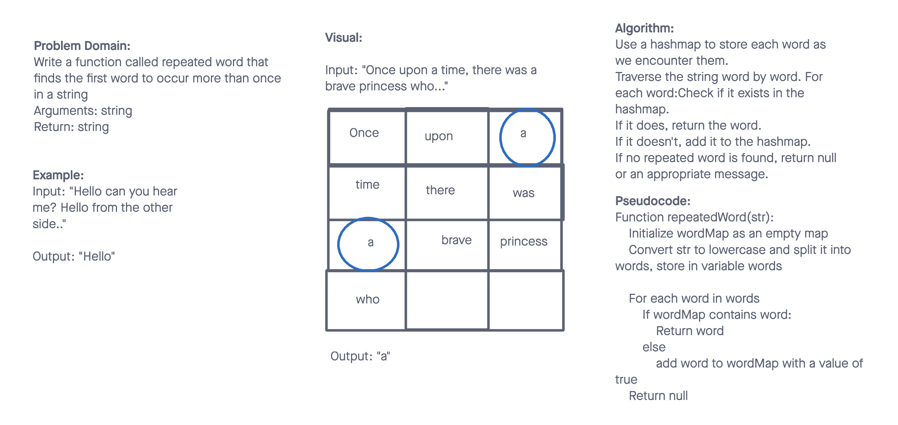

# Data Structures and Algorithms

## Hashmap Repeated Word

The Hashmap Repeated Word challenge focuses on determining the first repeated word in a given input string. By utilizing the Hash Table data structure, we can efficiently track words and quickly identify repetitions.

## Whiteboard Process

## Approach & Efficiency

The solution involves iterating through the input string word by word, and for each word, we check if it exists in our hash table. If it does, then it's our first repeated word and we return it. Otherwise, we add the word to our hash table and continue the process.

- Time Complexity - O(n)
- Space Complexity - O(n)

## Solution

- [Code Link](./index.js)
- [GitHub Actions](https://github.com/KatKho/data-structures-and-algorithms/actions)
