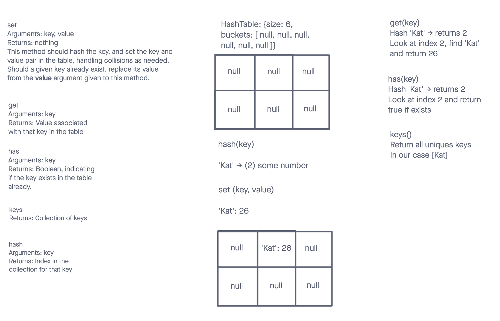

# Data Structures and Algorithms

## Hash Table

The Hash Table class is a data structure that provides fast access to values based on a unique key. Hash tables are particularly useful for tasks that require associative arrays or quick look-up operations.

## Whiteboard Process

## Methods

- hash(key): This function takes a unique key and returns a hash value, which is used to find the appropriate index for storing the key-value pair.
- set(key, value): This function sets a key-value pair in the hash table. It handles collisions by storing multiple key-value pairs in the same bucket.
- get(key): This function retrieves a value based on its key. It returns null if the key is not found.
- has(key): This function checks if a key exists in the hash table and returns a boolean value.
- keys(): This function returns all unique keys in the hash table.

## Big O

- hash(key)
Time Complexity: O(n), where n is the length of the key
Space Complexity: O(1)

- set(key, value)
Time Complexity: Average case O(1), worst case O(n) due to collisions
Space Complexity: O(1)

- get(key)
Time Complexity: Average case O(1), worst case O(n) due to collisions
Space Complexity: O(1)

- has(key)
Time Complexity: Average case O(1), worst case O(n) due to collisions
Space Complexity: O(1)

- keys()
Time Complexity: O(n), where n is the total number of keys in the hash table
Space Complexity: O(n) for storing the keys in an array

## Solution

- [Code Link](./index.js)
- [GitHub Actions](https://github.com/KatKho/data-structures-and-algorithms/actions)
