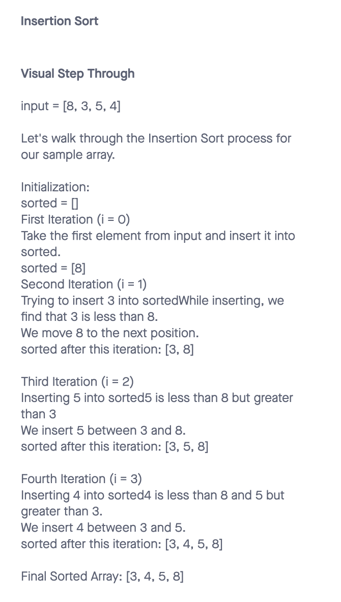

# Data Structures and Algorithms

## Insertion Sort

Insertion sort is a simple and intuitive sorting algorithm. The primary idea behind insertion sort is to build a sorted array one item at a time.

## Trace

## Big O

- Time: O(n^2)
- Space: O(1)

## Solution

- [Code Link](./index.js)
