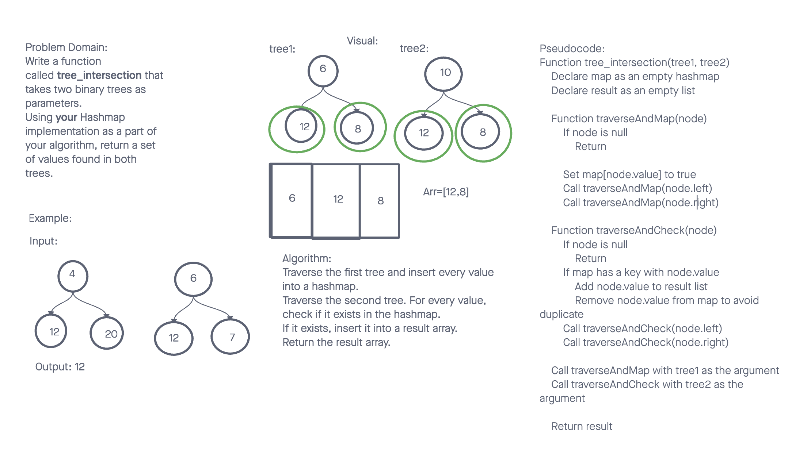

# Data Structures and Algorithms

## Tree Intersection

The Tree Intersection challenge focuses on finding and returning a set of values that exist in both given binary trees. By leveraging the Hashmap data structure, we can efficiently track values from one tree and quickly check for intersections with the second tree.

## Whiteboard Process

## Approach & Efficiency

The solution uses a hashmap to track the values of the first tree. We then traverse the second tree and check against this hashmap to find common values. This approach ensures that we do not have any duplicates in our result.

- Time Complexity: O(n + m) where n is the number of nodes in the first tree and m is the number of nodes in the second tree.
- Space Complexity: O(n) where n is the number of nodes in the first tree.

## Solution

- [Code Link](./index.js)
- [GitHub Actions](https://github.com/KatKho/data-structures-and-algorithms/actions)
