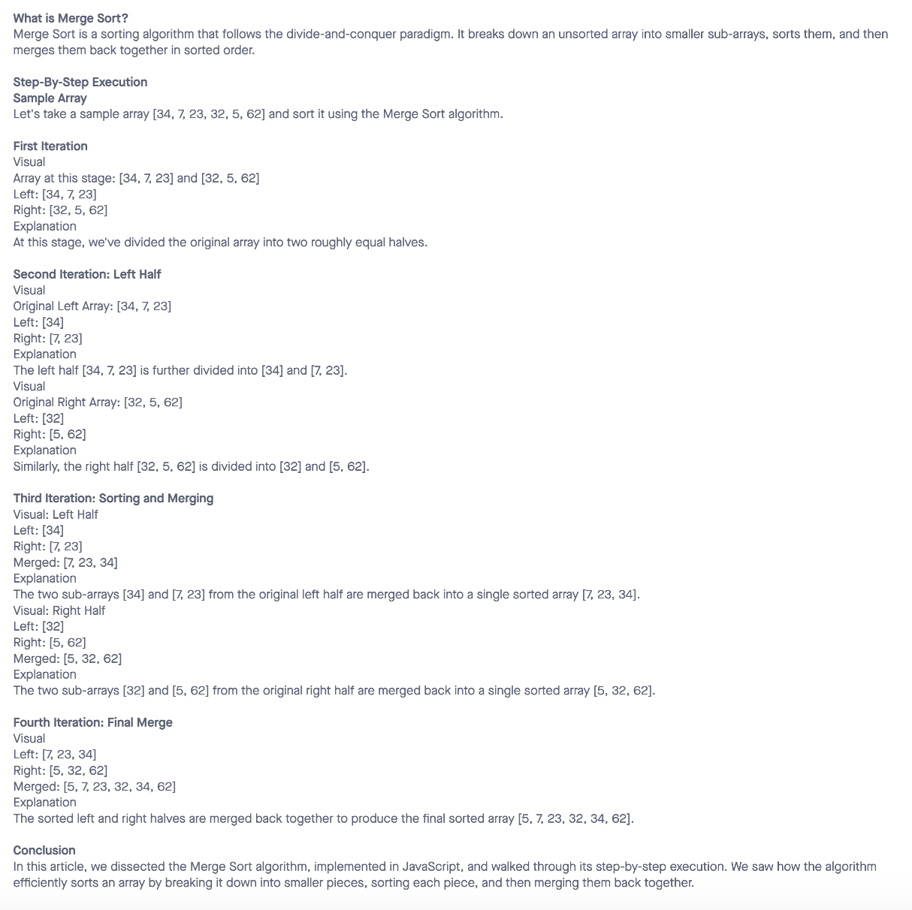

# Blog Notes: Merge Sort

Merge Sort is a sorting algorithm that follows the divide-and-conquer paradigm. It breaks down an unsorted array into smaller sub-arrays, sorts them, and then merges them back together in sorted order.

## Walk Through

## Big O

- Time: O(n log n)
- Space: O(n)

## Solution

- [Code Link](./index.js)
